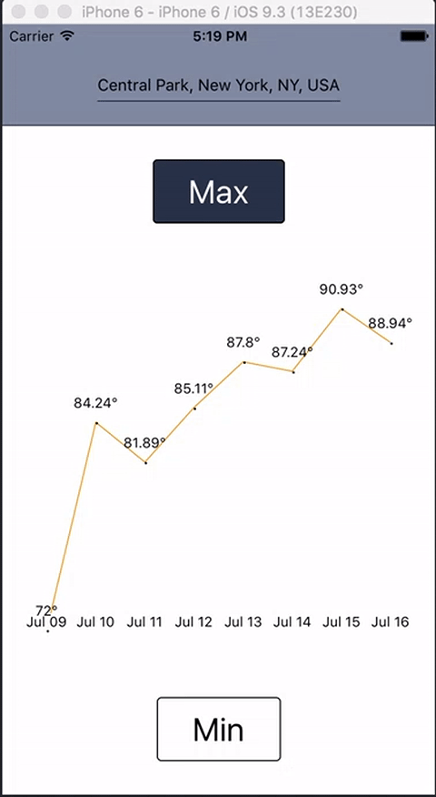

# BetterWeather

An example application to show how to use [d3js](https://d3js.org/) in a [React Native](https://facebook.github.io/react-native/) application.

Each commit has been structured to show how the application was incrementally created.

## Setup

1. [Follow the instructions on how to get started](https://facebook.github.io/react-native/docs/getting-started.html) on the official React Native website.
2. Copy `js/config.example.js` to `js/config.js` so that the React Native Packager does not complain that the file is missing. You do not need to update the file for the application to work.
3. Run the application just as you would any React Native application.